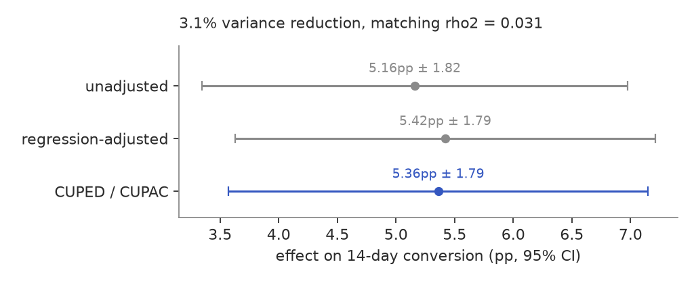
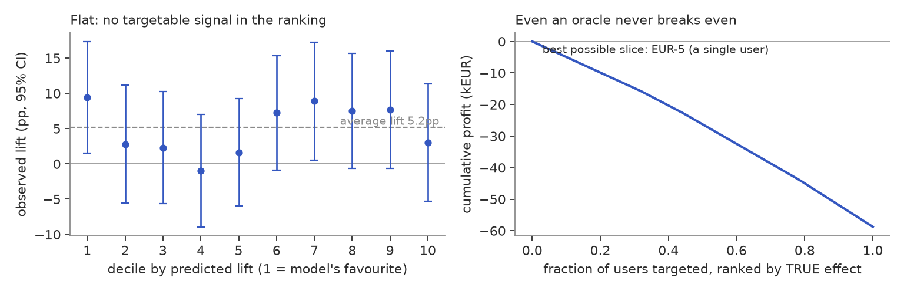

# Solvi: a product-analytics project on a neobank I made up

I wanted a project that felt like the actual job of a data scientist at a fintech:
event-level data, a warehouse, sign-up funnels, retention, an A/B test, and a real
decision at the end. The trouble with public datasets is that you can never fully check
your own analysis, because nobody knows what the true answer was supposed to be. So I did
it the other way around. I wrote a simulator that generates a fake neobank's data from
rules I control, hid three specific problems inside it, and then made myself rediscover
those problems using only the data, never the rules I used to make it.

A validation script grades the result by comparing what the analysis found against what I
actually planted. It recovers all 17 things I checked for, including the dates of an
outage down to the exact day.

The whole thing runs end to end:

- a Python **simulator** generates the raw events (181k users, 6.1M card transactions, 29 months),
- a **dbt + DuckDB** warehouse turns those events into clean tables (20 models, 42 tests),
- a set of Python **analyses** produce the findings and the numbers behind the dashboard.

Live interactive dashboard: [parkhouse.fr](https://parkhouse.fr) (the Solvi card).

## The three things I planted, and what the analysis found

### 1. A bad app release quietly broke KYC for one group of users

KYC is the identity check you pass when you open an account (photo of your ID, etc.). I
planted a bug in a fake Android release, version 5.27, that broke image handling for one
narrow case: people on Android submitting a national ID. Their approval rate dropped from
89% to about 69% the day that release shipped, and a hotfix two months later only brought
it back to about 79%, not all the way.

To find this without knowing where to look, I scan every (platform, document-type) group
day by day and ask: is there a single date where the approval rate clearly breaks? I use a
binomial likelihood-ratio test, which just measures how much better a "rate changed on day
X" story explains the data than a "nothing changed" story. Only one group out of eight
lights up, and the break lands exactly on the day release 5.27 shipped. The giveaway is
that almost all the extra rejections are `doc_unreadable`, which is what a broken image
upload looks like, not a fraud spike. I then size the damage against that group's own
earlier rate: roughly 2,000 lost approvals and 1,100 lost sign-ups so far, and a 9-point
gap that is still open because the hotfix didn't fully fix it.

### 2. Paid social pays about €98 for a user worth about €11

This one only shows up when you put retention, margin, and acquisition cost together. The
trap is the denominator. Marketing reports cost-per-signup, but margin is earned per
*activated* user (someone who actually starts paying with the card), and channels activate
at very different rates. If you don't divide the cost by the activation rate first, the
expensive channels look about three times healthier than they are.

| channel | churn / mo | LTV (36 mo) | cost per activated user | payback |
|---|---|---|---|---|
| organic | 4.1% | €25 | €5 | 6 months |
| referral | 3.3% | €32 | €26 | 29 months |
| influencer | 6.8% | €15 | €55 | never |
| paid social | 7.7% | €11 | €98 | never |

Paid social has both the worst retention and the highest cost, so it loses money the
moment you buy the user. Referral and organic are what actually carry the book. The
takeaway I'd give a growth team: move budget out of paid social and into referral, which
stays profitable even if you pay people more to refer friends.

### 3. An A/B test that's a clear statistical win and still shouldn't ship

I ran an experiment called TOPUP10: give new users a €10 credit if their first top-up is
at least €20 within 14 days. Users were split 50/50 the moment they passed KYC (10,154 of
them). First I checked the split actually came out 50/50 (it did), because if the
randomisation is broken nothing else is trustworthy.

The result is a big, obvious win on the headline number: first top-ups within 14 days went
from 65.0% to 70.2%, a 5.2-point lift with a p-value around 3e-8 (so the lift is real, not
noise). And it should still not ship, because of what it costs. Everyone who converts collects the €10, but most of those
people (the "always-takers") would have topped up anyway. Once you only count the *extra*
conversions the bonus actually caused, each one costs between €102 and €159 depending on the
channel, against users worth €11 to €32 over three years. So it loses money everywhere,
even if I generously assume the extra users are worth the channel average (they're worth
less). And the channel breakdown offers no escape either: the lift is statistically the
same everywhere (the interaction test finds nothing), so there is no "responsive" segment
to rescue the economics by aiming better. Margin over the 60 days after
assignment, after subtracting the bonus, comes out to about -€6.74 per treated user.

I also added a small piece on why you can't just watch an experiment's dashboard and stop
when it looks significant. If I replay this experiment's exact enrollment 4,000 times with
no real effect and peek every day at the usual cutoff, I "find" a significant result 32.2%
of the time anyway. A boundary that gets stricter the earlier you look (an
O'Brien-Fleming-style rule, with the constant tuned by simulation to hold a 5% error rate)
fixes that, and still flags this genuine effect on day 16 of 55.

## Two follow-ups the experiment earned

### CUPED, for real this time

In the write-up above I adjusted for covariates with a regression and called it
"CUPED-style". That hedge bothered me, so I read the actual paper (Deng, Xu, Kohavi and
Walker 2013) and implemented the real estimator. There is a catch. CUPED wants each
user's own pre-experiment behaviour as the covariate, and my subjects are brand-new
users with no pre-period. DoorDash's CUPAC variant gets around it: train a model on
users from before the experiment, and use its prediction as the covariate. I trained
mine on 88k pre-experiment sign-ups.



The result is tidy. 3.1% variance reduction, which is almost exactly the rho-squared of
0.03 the paper predicts, and almost exactly what my plain regression had already
achieved. That makes sense: both methods see the same four demographic fields, and four
demographic fields only know so much. On the margin guardrail the reduction is 0.2%. So
the machinery works, it just has nothing to work with here. CUPED pays off when there is
rich pre-period behaviour to lean on, and new users are exactly the case where there
isn't any. (`analysis/cuped.py`)

### Can targeting rescue the bonus?

The verdict above says there is no responsive segment to aim the bonus at. I had
asserted that from four channel averages, so I built the model that actually tries: a
T-learner uplift model. Two gradient-boosted classifiers, one per arm, fitted on half
the subjects. Every judgement below comes from the other half, which the models never
saw. The model ranks each user by their predicted individual lift.

I got this wrong on the first try. I scored everyone out-of-fold, thinking that was the
careful option, and the decile chart came out upside down. With four categorical
features users live in a few hundred cells, and a leave-out score inside a cell is
roughly the cell mean minus your own outcome, so converters get ranked below their
neighbours and the evaluation quietly poisons itself. Fitting on one half and judging on
the other fixes it, because everyone in a cell gets the same score.



The left panel is the answer. Sort the held-out users into ten groups by predicted lift
and the observed lift per group is flat within noise. The model agrees with the channel
analysis instead of inventing structure. Whatever makes one person more persuadable than
their neighbour is not visible in anything Solvi knows at assignment time. The economics
settle it anyway: an extra conversion buys about €1 of value per deployed user, at a
generous channel-average LTV, and costs about €6.90 in expected bonus. No slice of any
size goes positive, whether you rank by predicted lift or by predicted profit.
(`analysis/uplift.py`)

The right panel is the check I am proudest of, and it is only possible because the world
is simulated. Three new ground-truth checks grade the model, 17 in total now. Its
average predicted effect lands on the true average for the held-out users: 5.9pp
predicted, 6.1pp true. The truth confirms there was no profitable segment for it to
miss. And an oracle that knows every user's true effect exactly still cannot make
TOPUP10 pay. The best possible slice is a single user, and even that user costs more
than they are worth.

I should mention that the simulator does plant channel-level differences in
persuadability. At five thousand users per arm this draw simply does not reveal them,
and a model cannot learn what the sample does not show. Detecting who responds takes far
more data than detecting whether anyone responds.

## How it fits together

```
simulator/   Python generative model  ->  data/raw/*.parquet   (+ ground truth, kept separate)
warehouse/   dbt + DuckDB
  staging/      one cleaned view per raw table
  marts/        dim_users, fct_activity_monthly, fct_kyc_attempts, fct_experiment_users
  exports/      small aggregate tables that feed the dashboard
  tests/        funnel never grows down the stages, 50/50 split holds, payouts only to treatment, ...
analysis/    Python: the KYC scan, channel economics, the A/B test write-up,
             the peeking demo, the ground-truth check, and the dashboard export
DESIGN.md    every rule and number the simulator uses, written out
```

## The one rule I held myself to

The warehouse and the analyses are only ever allowed to read `data/raw/` and the tables
built from it. They never read `data/ground_truth/` or the simulator's settings. The single
exception is `analysis/validate_truth.py`, whose whole job is to compare what the analysis
found against what I planted and report the gap. That's what keeps the project honest: the
findings have to come from the data, not from me knowing the answer.

The assumptions a real analyst would get from finance (interchange rate, acquisition cost,
variable cost) live in the dbt config and a small CSV, so they're written down in one place
instead of buried in code.

## A metrics layer on the marts

The marts also carry a semantic layer in `warehouse/models/marts/schema.yml`, written in
Lightdash's dbt-native `meta` format. Lightdash is the open-source equivalent of Looker
and its LookML. Metrics like KYC approval rate, activation rate, 14-day top-up conversion
and contribution margin are defined once, next to the models and their tests, instead of
being re-derived slightly differently in every dashboard query. Point Lightdash at the
dbt project and the whole warehouse is explorable without writing SQL. Slicing approval
rate by platform, document type and date puts the v5.27 incident straight on the screen.

## Running it

```bash
python -m venv .venv
.venv/Scripts/pip install -r requirements.txt # Linux/Mac: .venv/bin/pip
.venv/Scripts/python scripts/run_pipeline.py
```

A couple of minutes total: simulate (around 7 seconds), `dbt build` (62 models and tests
pass), the analyses (the uplift and CUPED model fits are the slow part), then the 17/17
ground-truth check.

## What isn't realistic (on purpose)

The simulated world is simpler than a real one, and I list every shortcut in
[DESIGN.md](DESIGN.md) section 7. The main ones: money isn't strictly conserved, churned
users never come back, there's only one experiment and it randomises perfectly, and
acquisition cost is an assumption rather than something measured. I kept the model simple
so it stays auditable, which is the entire point. The methods themselves (the changepoint
scan, Wilson confidence intervals, regression-adjusted experiment analysis with robust
standard errors, bootstrap intervals, the peeking correction, the cost-per-activated fix)
are the ones I'd actually use on real data.
